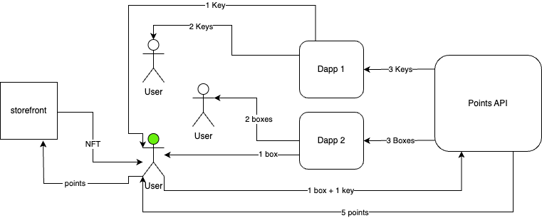

# Flow Points API Examples

This repo contains several examples of simple scripts that demonstrate interactions with the Flow Points API, which allows you to distribute boxes and/or keys to your users.  You can use these examples directly, or as a guide for your own implementation.

[API Documentation]





## Endpoint

https://crescendo-rewards-cxc3jxjjdq-uc.a.run.app

Note that the root URL does not handle `GET` requests.

## .ENV

`.env.example` contains the environment variables used by these scripts:

* **API_URL:** https://crescendo-rewards-cxc3jxjjdq-uc.a.run.app
* **PUBLIC_SIGNER_ADDRESS:** The Ethereum address you've registered for the Points program.  Contact `partnerships@flow.com` if you need to add or change your address.
* **WALLET_PRIVATE_KEY:**  The private key for the `PUBLIC_SIGNER_ADDRESS`.  Used to sign a message to obtain an authentication JWT from the server.
* **PUBLIC_RECIPIENT_ETH_ADDRESS:**  An Ethereum address used for testing various endpoints in the sample usage code.
* **PUBLIC_RECIPIENT_FLOW_ADDRESS:** A Flow address used for testing `getUserPointsByFlowAddress.js`.

## getUserPointsByEthAddress.js

You can retrieve the current points balance (boxes and/or keys) for **any** Ethereum address.  This endpoint does **not** require authentication.

You can use this script with your `PUBLIC_SIGNER_ADDRESS` to see your current balance as well.

### Sample Output

```zsh
User Points for 0xa4Fe9176f54808a54362b1569D3FA0dba7D4F59c: {
  eth_address: '0xa4Fe9176f54808a54362b1569D3FA0dba7D4F59c',
  keys: '99996',
  boxes: '99996',
  points: '0',
  boxes_opened: '0'
}
```

## getUserPointsByFlowAddress.js

You can also get a user's points from their Flow address, but they **must** have the points in a COA controlled by the Flow account.

### Sample Output

**Note:** Both endpoints to get a user's points respond with that user's Ethereum address.

```zsh
User Points for 0xa4Fe9176f54808a54362b1569D3FA0dba7D4F59c: {
  eth_address: '0xa4Fe9176f54808a54362b1569D3FA0dba7D4F59c',
  keys: '99996',
  boxes: '99996',
  points: '0',
  boxes_opened: '0'
}
```

## getJWT.js

Handles the process of obtaining an authentication token.  Tokens **expire** after 24 hours.

**Warning**: The "Create Challenge" endpoint will return a challenge string for any supplied address.  You'll receive an error that the `Challenge not found or expired` if you submit a signed response correctly for an address that isn't registered.

Contact `partnerships@flow.com` if you need to add or change your address.

## createPointsTransferBatch.js

As a partner, you most likely receive **either** _boxes_ **or** _keys_.  The same API endpoint is used to create a batch of transfer requests for either type of reward.

A transfer request transfers the indicated amount of boxes and/or keys from your `PUBLIC_SIGNER_ADDRESS` to the provided **Ethereum** address.  Normally this will be a user you wish to reward.

The example sets the `secondsToFinalize` to 300 seconds.  Batches are **automatically executed** after this time passes.

You can modify this to suit your needs.  If your use case calls for it, be sure to allow enough time to ensure deletion of created batches before their execution.

### Sample Input

```javascript
const transfers = [
  {
  toAddressId: process.env.PUBLIC_RECIPIENT_ETH_ADDRESS, // Example recipient Ethereum address
  keys: "1", // Number of keys to transfer
  boxes: "1"  // Number of boxes to transfer
  }
];
```

**Note**: The sample creates a transfer for one key and one box.  Most partners will receive one or the other.

### Sample Output

```zsh
Transfer Batch Created Successfully: {
  batchId: '17f223ee-b959-40f8-9f49-10c358cfdf61',
  message: 'Transfer batch created successfully'
}
```

## getTransferBatchById.js

You can retrieve an individual transfer batch by id.

### Sample Output

```zsh
Transfer Batch Retrieved Successfully: {
  batchId: '17f223ee-b559-40f8-9f49-00c358cfdf60',
    transfers: [
      {
        keys: '1',
        boxes: '1',
        points: '0',
        toAddressId: '0x8750A76F91C48A439f8595Fbe40898211A70aD7C'
      }
    ],
      status: 'FINALIZED',
        secondsToFinalize: 300
}
```

## getAllTransferBatches.js

You can also easily retrieve all the transfer batches ever created by **your** address.

### Sample Output


```zsh
All Transfer Batches Retrieved Successfully: [
  {
    "batchId": "c6e77edb-976f-4340-bd63-9e54a8848a52",
    "transfers": [
      {
        "keys": "1",
        "boxes": "1",
        "points": "0",
        "toAddressId": "0x9750A76F91C48A339f8595Fbe40898111A70aD7C"
      }
    ],
    "status": "FINALIZED",
    "secondsToFinalize": 300
  },
  {
    "batchId": "dbab88d1-2358-4f3c-a5cb-a37bc998c2b2",
    "transfers": [
      {
        "keys": "1",
        "boxes": "1",
        "points": "0",
        "toAddressId": "0x9750A76F91C48A339f8595Fbe40898111A70aD7C"
      }
    ],
    "status": "FINALIZED",
    "secondsToFinalize": 300
  },
  {
    "batchId": "e5fcbc49-9772-4088-bf7b-0a43f07bbb7c",
    "transfers": [
      {
        "keys": "1",
        "boxes": "1",
        "points": "0",
        "toAddressId": "0x9750A76F91C48A339f8595Fbe40898111A70aD7C"
      }
    ],
    "status": "FINALIZED",
    "secondsToFinalize": 300
  },
  {
    "batchId": "17f223ee-b559-40f8-9f49-00c358cfdf60",
    "transfers": [
      {
        "keys": "1",
        "boxes": "1",
        "points": "0",
        "toAddressId": "0x9750A76F91C48A339f8595Fbe40898111A70aD7C"
      }
    ],
    "status": "FINALIZED",
    "secondsToFinalize": 300
  }
]
```

## deletePointsTransferBatch.js

**WARNING:  This script is non-functional.  We are working on debugging!**

If you'd like, you can delete a transfer batch **before it executes**.  You must have the id of the batch you wish to delete.

### Sample Output

```zsh

```

## Finding Ethereum Address from Flow Address

Flow accounts must have a Cadence Owned Account (COA) to participate in this program.  To validate (or find) a user's Ethereum address for their COA, you can use this snippet.

**Note:** This code is **not** complete.  It assumes that you are placing it in a React app that is already interacting with Flow Cadence.  Review the [Simple Frontend Quickstart] and [FCL docs] if you need a place to test it.

```javascript
  // Incomplete snippet.  Requires FCL setup and Wallet Discovery
  const [coaAddress, setCoaAddress] = useState('');

  const queryCoaAddress = async () => {
    const res = await fcl.query({
      cadence: `
        import "EVM"

        /// Retrieves the EVM address from the provided Flow account address's COA stored in the standard path
        ///
        /// @param address: The Flow account address
        ///
        /// @return The EVM address as a string or nil if the COA is not found
        ///
        access(all)
        fun main(address: Address): String? {
            if let coa = getAuthAccount<auth(BorrowValue) &Account>(address).storage.borrow<&EVM.CadenceOwnedAccount>(
                from: /storage/evm
            ) {
                return coa.address().toString()
            }
            return nil
        }
      `,
      args: (arg, t) => [arg(user.addr, t.Address)]
    });
    setCoaAddress(res);
  }

  useEffect(() => {
    if (user.loggedIn) {
      queryCoaAddress(user.addr);
    }
  }, [user]);
```

## Creating a COA

If the user does not have a COA, you can send them a transaction to do so.  Again, this must be integrated into a connected frontend.

```cadence
import "EVM"
import "FungibleToken"
import "FlowToken"

/// Creates a COA and saves it in the signer's Flow account & passing the given value of Flow into FlowEVM
transaction(amount: UFix64) {
    let sentVault: @FlowToken.Vault
    let auth: auth(IssueStorageCapabilityController, IssueStorageCapabilityController, PublishCapability, SaveValue, UnpublishCapability) &Account

    prepare(signer: auth(BorrowValue, IssueStorageCapabilityController, PublishCapability, SaveValue, UnpublishCapability) &Account) {
        let vaultRef = signer.storage.borrow<auth(FungibleToken.Withdraw) &FlowToken.Vault>(
                from: /storage/flowTokenVault
            ) ?? panic("Could not borrow reference to the owner's Vault!")

        self.sentVault <- vaultRef.withdraw(amount: amount) as! @FlowToken.Vault
        self.auth = signer
    }

    execute {
        let coa <- EVM.createCadenceOwnedAccount()
        coa.deposit(from: <-self.sentVault)

        let storagePath = StoragePath(identifier: "evm")!
        let publicPath = PublicPath(identifier: "evm")!
        self.auth.storage.save<@EVM.CadenceOwnedAccount>(<-coa, to: storagePath)
        let addressableCap = self.auth.capabilities.storage.issue<&EVM.CadenceOwnedAccount>(storagePath)
        self.auth.capabilities.unpublish(publicPath)
        self.auth.capabilities.publish(addressableCap, at: publicPath)
    }
}
```

<!-- Reference-Style Links -->

[API Documentation]: https://truth-ox-40d.notion.site/Flow-Points-API-Documentation-For-Partners-fb60ecbf7dc14cb7926bb4ada00123ef
[Simple Frontend Quickstart]: https://developers.flow.com/build/getting-started/fcl-quickstart
[FCL docs]: https://developers.flow.com/tools/clients/fcl-js